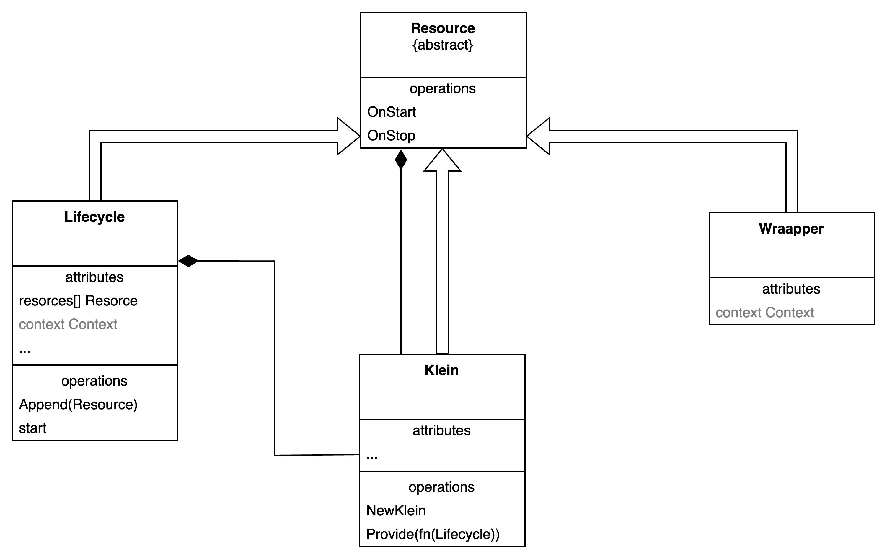

# goKlein

# usage
```shell
go get github.com/daniel-kiluange/goKlein
```
```go
func main() {
	k := klein.NewKlein()

	go func() {
		time.Sleep(5 * time.Second)
		k.Stop()
	}()

	k.Provide(newHttpServer)

	k.Run()

}
```

### Embedding code
```go
func newHttpServer(lc *klein.Lifecycle) *klein.Wrapper {
    return &klein.Wrapper{
		mux := http.NewServeMux()
        OnStart: func () error {
            println("Starting HTTP server")
            mux.HandleFunc("/", func(w http.ResponseWriter, r *http.Request) {
                w.Write([]byte("Hello, world!"))
            })
			go http.ListenAndServe(":8080", mux)
            return nil
    },
        OnStop: func () error {
            println("Stopping HTTP server")
            return nil
        },
    }
}

```   


